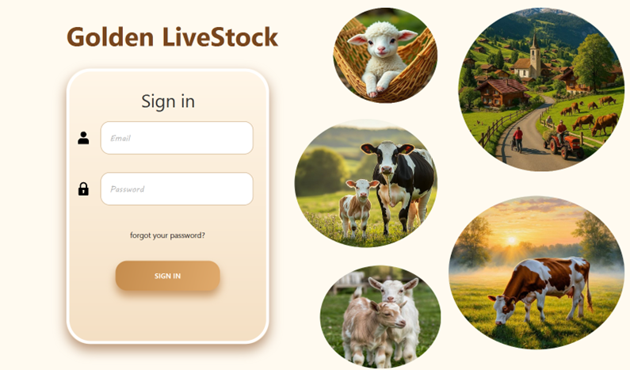
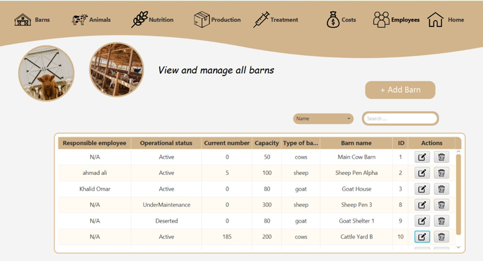
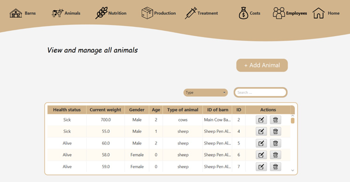
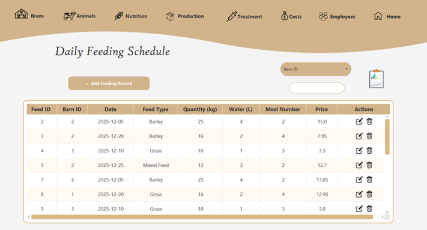
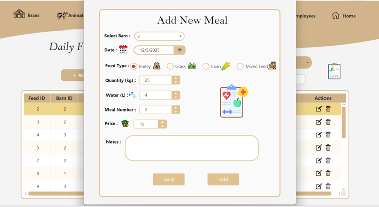
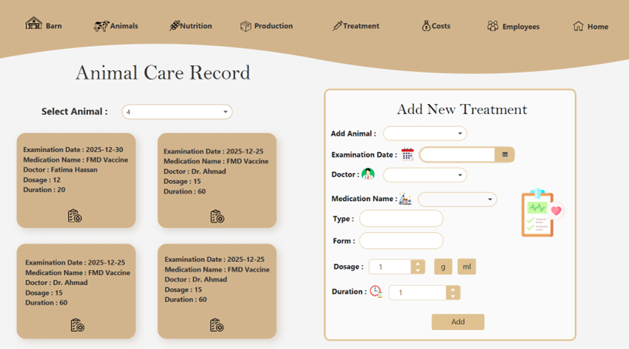
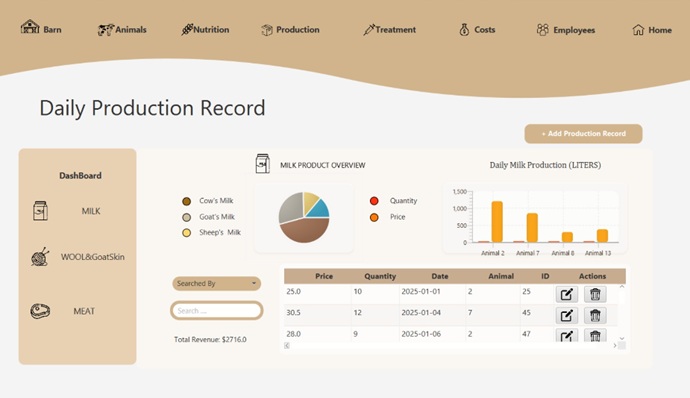
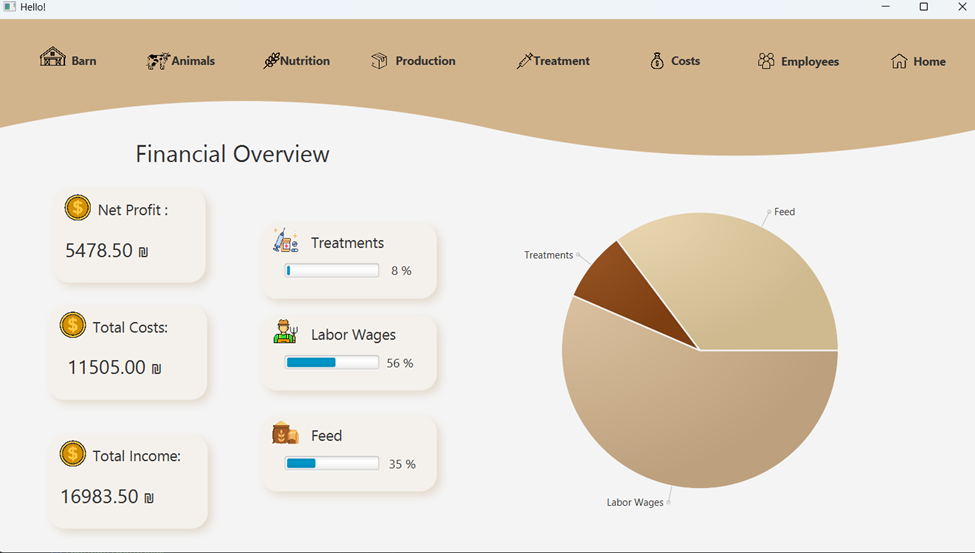
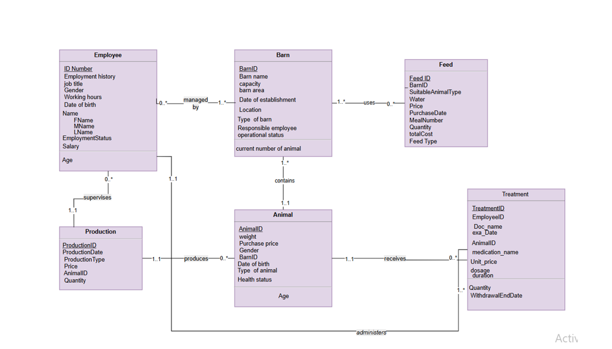

# 🌾 Farm Management System

A desktop application developed using **JavaFX** and **PostgreSQL** to simplify and automate farm management operations.

The system provides an intuitive graphical interface that enables farmers and administrators to manage animals, barns, employees, nutrition schedules, treatments, production records, operational costs, and analytical reports in one integrated platform.

📄 **Project Documentation:** [View the Complete Project Report (PDF)](Farm_Management_System_Report.pdf)

## 📖 Overview

Managing a farm involves handling large amounts of information related to livestock, production, feeding schedules, medical treatments, employees, and expenses.

The Farm Management System was developed as a university database project to provide an organized and efficient solution for managing these operations through a centralized database and a user-friendly desktop application.

The application supports data management, visualization, reporting, and daily operational monitoring.

# 🎯 Project Objectives

The project aims to:

- Improve farm management efficiency.
- Reduce manual record keeping.
- Provide accurate reports.
- Support better decision making.
- Centralize all farm operations in one system.

## ✨ Key Features

- 🔐 Secure User Authentication
- 🐄 Animal Management
- 🏠 Barn Management
- 👨‍🌾 Employee Management
- 🌾 Feeding Management
- 💉 Treatment Management
- 🥛 Production Tracking
- 💰 Cost Analysis
- 📈 Interactive Dashboard
- 📊 Charts & Statistics
- 📄 JasperReports Integration
- 🔍 Data Filtering & Search

# 🖥 Screenshots

## Login

## Barn Management

## Animal Management

## Feeding Management

## Treatments Dashboard

## Production Dashboard

## Cost Analysis

# 🗺 System Architecture

# 🗄 Database Design
The database was designed following database normalization principles and includes entities such as:

- Animals
- Barns
- Employees
- Feed
- Treatments
- Production
- Costs
- Employee_Barn
- Barn_Feed
- Feeding_Log
- Animal_Treatment

The project includes:

- Functional Dependencies
- Normalization (1NF, 2NF, 3NF, BCNF)
- ER Diagram
- Relational Mapping

# 📊 Reports

The application generates analytical reports using **JasperReports**, helping users monitor:

- Feeding records
- Production
- Farm costs
- Statistics
- Daily activities

# 🛠 Technologies Used

| Technology | Purpose |
|------------|----------|
| Java | Application Logic |
| JavaFX | Desktop GUI |
| PostgreSQL | Database |
| JDBC | Database Connectivity |
| Maven | Dependency Management |
| Scene Builder | GUI Design |
| JasperReports | Reporting |
| Draw.io | ER Diagrams |
| IntelliJ IDEA | Development Environment |

# 📚 Documentation

The repository includes the complete project documentation containing:

- Project Introduction
- Requirements
- Database Design
- Functional Dependencies
- Normalization
- ER Diagram
- GUI Description
- Reports
- References

